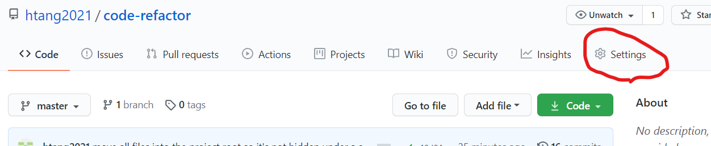
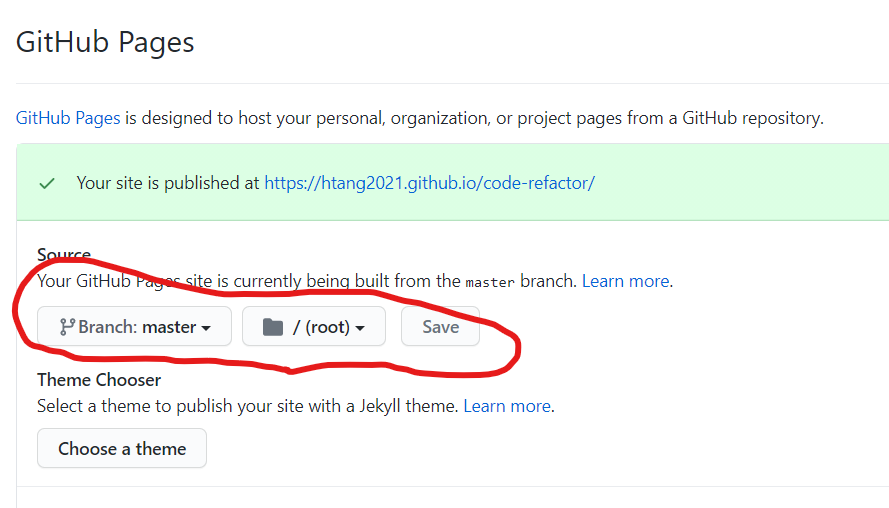

# Horiseon Code Refactor Project
Legal & Copyright statements

# Project Objective
This project is to refactor the html and css code that meets Horiseon's acceptance criteria of not only to make the code base cleaner but also to make the site optimized for search engine and meets accessibility standards.

# Updates Made
- Updated and verified all links work in HTML and CSS files
- Incorporated semantic elements and descriptions in HTML file
- Incorporated semantic selectors and properties that corresponds to HTML class definition
- Consolidated redundant class selectors
- Updated directory name where all codes sit in

# Mock-up image of Horiseon Home Page
Mock-up image of the site is as follows:

# Github Repository
All files and changes made are located on github at the following location:

https://github.com/htang2021/code-refactor

A copy of this README.md file is also at the github location.

# Application Live URL
https://htang2021.github.io/code-refactor/

# Deploy Your Project

This instruction below assumes that a project and repo were created early on and that they are already linked.
1. Login to github and go to the project repo (https://github.com/htang2021/code-refactor).

2. Click on "Settings" in the repo menu, also shown in the screenshot below:

3. Scroll down to the GitHub Pages section and select branch where the site will be built from, will either be "master" or "main" and with folder in /root.  Click on "Save" button next to it.  Screen shot below for reference:

4. As shown in the image from 3, if saved successfully, GitHub will return a live site URL:
https://htang2021.github.io/code-refactor/

End of README.md - updated by Hung Tang on 1/30/21